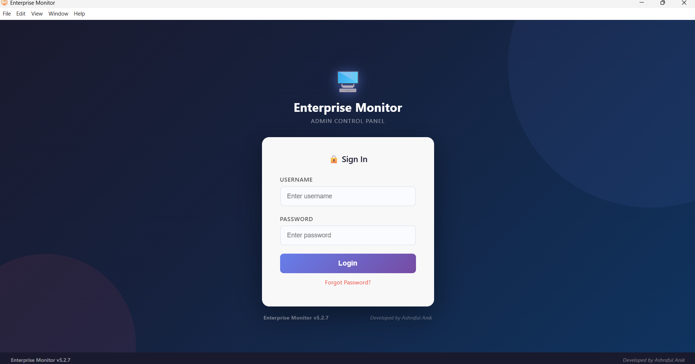
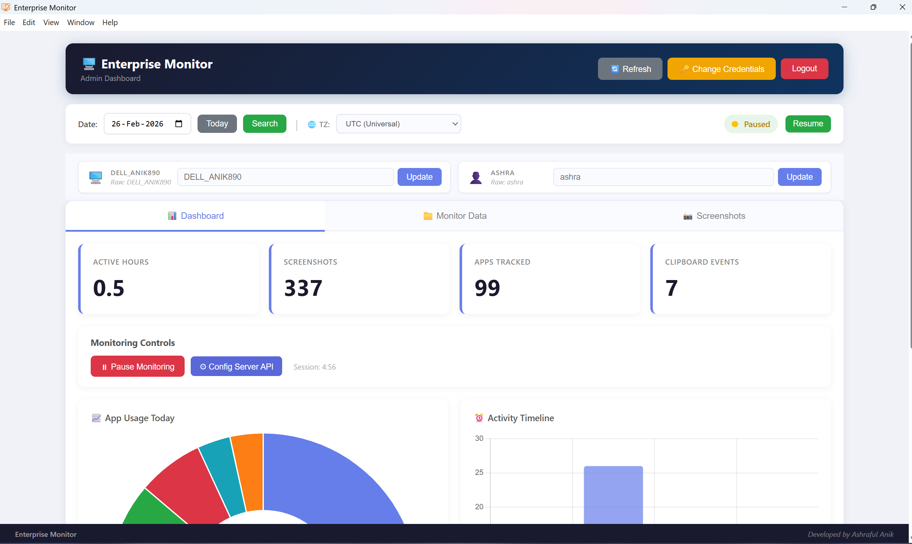
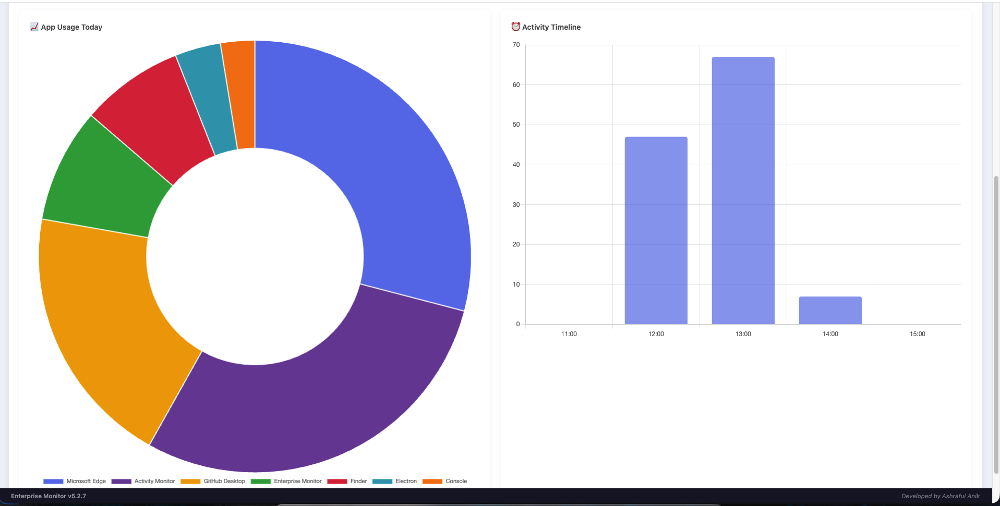
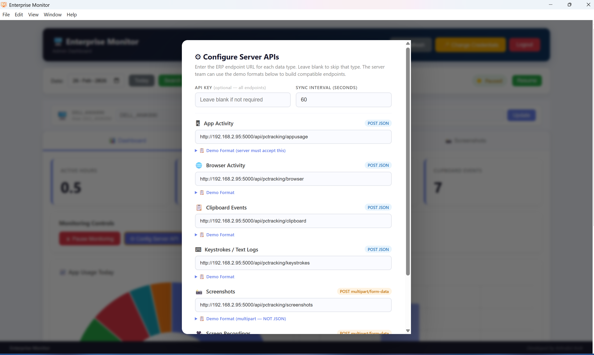

<p align="center">
  
  
  
  
  
</p>

# 🖥️ Enterprise Monitor

**A production-grade, cross-platform employee activity monitoring system for Windows and macOS** — built with a **Master/Child process architecture** that pairs an **Electron desktop UI** with a **Python FastAPI backend**, all packaged into a single installer (NSIS on Windows, DMG on macOS) via `electron-builder`.

This project demonstrates deep expertise in **systems programming**, **cross-platform desktop application architecture**, **real-time monitoring**, **secure authentication**, **multi-threaded data pipelines**, and **enterprise deployment** — including Windows Registry auto-start, macOS LaunchAgents, Hardened Runtime entitlements, TCC permission management, and graceful shutdown orchestration.

---

## 🖼️ Screenshots

### Windows

<details>
<summary>Click to expand Windows screenshots</summary>

#### Login Page
> Gradient background with animated floating circles, credential-protected access, and a forgot password flow via security Q&A.

<p align="center">
  
</p>

#### Admin Dashboard
> Real-time statistics with Chart.js visualizations — active hours, apps tracked, screenshots, clipboard events. Timezone-aware display with selector.

<p align="center">
  
</p>

<p align="center">
  
</p>

#### Monitoring Data
> Tabbed interface for App Activity, Browser logs, Clipboard events, Keystrokes, and Screen Recordings.

<p align="center">
  
</p>

<p align="center">
  
</p>

#### Server & API Configuration
> 6 configurable ERP endpoint URLs with live payload preview and API key setup.

<p align="center">
  
</p>

#### Credential Management
> Username/password change with mandatory security Q&A setup for password recovery.

<p align="center">
  
</p>

</details>

### macOS

#### Dashboard (macOS)
> Same feature-rich dashboard running natively on macOS with real-time app usage charts, activity timeline, and monitoring controls.

<p align="center">
  
</p>

#### Screenshots Gallery (macOS)
> Periodic screen captures displayed in a grid view with timestamps and active application context.

<p align="center">
  
</p>

#### Screen Recording (macOS)
> Continuous MP4 recording with configurable chunk durations — files stored in `~/Library/Application Support/EnterpriseMonitor/videos/`.

<p align="center">
  
</p>

---

## 📋 Table of Contents

- [Architecture Overview](#-architecture-overview)
- [Cross-Platform Design](#-cross-platform-design)
- [Feature Highlights](#-feature-highlights)
- [Technology Stack](#-technology-stack)
- [Security Design](#-security-design)
- [Project Structure](#-project-structure)
- [Monitoring Capabilities](#-monitoring-capabilities)
- [ERP Sync Engine](#-erp-sync-engine)
- [Installation & Development](#-installation--development)
- [Build & Distribution](#-build--distribution)

---

## 🏗️ Architecture Overview

```
┌──────────────────────────────────────────────────────────────--───┐
│                     ELECTRON (Master Process)                     │
│                                                                   │
│  ┌──────────┐   ┌──────────────-┐   ┌──────────────────────────┐  │
│  │  Tray    │   │  BrowserWindow│   │  Preload (Context Bridge)│  │
│  │  Manager │   │  (Renderer)   │   │  • Secure IPC Bridge     │  │
│  └──────────┘   └──────┬──────-─┘   └──────────────────────────┘  │
│                        │ IPC Handlers                             │
│  ┌─────────────────────┴───────────────────────────────────────┐  │
│  │ Main Process: spawn → port.info handshake → ApiClient       │  │
│  └─────────────────────────────────────────────────────────────┘  │
│          │ HTTP (dynamic port)                                    │
└──────────┼───────────────────────────────────────────────────--───┘
           │
           ▼
┌────────────────────────────────────────────────────────────────--─┐
│              PYTHON BACKEND (Child Process)                       │
│          ┌─────────────┐  ┌─────────────────┐                     │
│          │   Windows   │  │     macOS        │                    │
│          │  (pywin32,  │  │  (AppleScript,   │                    │
│          │  UIAuto)    │  │  pyobjc, TCC)    │                    │
│          └─────────────┘  └─────────────────┘                     │
│                                                                   │
│  ┌──────────────────────────────────────────────────────────────┐ │
│  │  FastAPI + Uvicorn (dynamic port, 127.0.0.1 only)            │ │
│  │  • JWT Auth  • REST API  • CORS  • Lifecycle Hooks           │ │ 
│  │  • Graceful Shutdown Endpoint (/api/shutdown)                | │
│  └──────────────────────────────────────────────────────────────┘ │
│                                                                   │
│  ┌──────────┐ ┌──────────┐ ┌──────────┐ ┌────────────────────┐    │
│  │Screenshot│ │App       │ │Browser   │ │Keylogger           │    │
│  │Monitor   │ │Tracker   │ │Tracker   │ │(pynput)            │    │
│  └──────────┘ └──────────┘ └──────────┘ └────────────────────┘    │
│  ┌──────────┐ ┌──────────┐ ┌──────────┐ ┌────────────────────┐    │
│  │Clipboard │ │Screen    │ │Sync      │ │Data Cleanup Service│    │
│  │Monitor   │ │Recorder  │ │Service   │ │(7-day retention)   │    │
│  │          │ │(OpenCV)  │ │(6-type)  │ └────────────────────┘    │
│  └──────────┘ └──────────┘ └──────────┘                           │
│                                                                   │
│  ┌──────────────────────────────────────────────────────────────┐ │
│  │  SQLite (WAL mode, shared connection, thread-safe Lock)      │ │
│  │  • screenshots • app_activity • browser_activity             │ │
│  │  • clipboard_events • text_logs • video_recordings           │ │
│  │  • device_config                                             │ │
│  └──────────────────────────────────────────────────────────────┘ │
└─────────────────────────────────────────────────────────────────--┘
```

### Master/Child Process Model

| Aspect | Electron (Master) | Python Backend (Child) |
|---|---|---|
| **Lifecycle** | Spawns backend, owns shutdown | Dies with master |
| **Port** | Polls `port.info` | Writes atomically (tmp → rename) |
| **Communication** | HTTP via `ApiClient` | FastAPI REST API |
| **Startup Guard** | Deletes stale `port.info` | Platform-specific single-instance lock |
| **Shutdown** | Graceful HTTP → force-kill fallback | `/api/shutdown` → stops all services |
| **Auto-start** | `app.setLoginItemSettings()` (primary) | Spawned by Electron on startup |

---

## 🔀 Cross-Platform Design

The app shares a **single Electron frontend** but uses **platform-specific Python backends** with identical REST API contracts. Each backend adapts to the native OS capabilities:

| Feature | Windows (`backend-windows/`) | macOS (`backend-macos/`) |
|---|---|---|
| **Active Window** | `win32gui` + `psutil` | AppleScript (`System Events`) |
| **Window Title** | `win32gui.GetWindowText()` | JXA (`windows[0].name()`) |
| **Browser URLs** | `uiautomation` COM API (14+ browsers) | AppleScript per-browser scripts (12+ browsers) |
| **Keyboard Hook** | `pynput` | `pynput` (requires Input Monitoring permission) |
| **Clipboard** | `pyperclip` | `pyperclip` |
| **Screenshots** | `mss` + `Pillow` | `mss` + `Pillow` |
| **Screen Recording** | `OpenCV` + `mss` | `OpenCV` + `mss` |
| **Single Instance** | Named Windows Mutex | `fcntl.flock()` (POSIX file lock) |
| **Auto-start** | Windows Registry `Run` key | `app.setLoginItemSettings()` + LaunchAgent (fallback) |
| **Data Directory** | `%LOCALAPPDATA%\EnterpriseMonitor` | `~/Library/Application Support/EnterpriseMonitor` |
| **Installer** | NSIS (`.exe`) | DMG (`.dmg`) |
| **Permissions** | UAC (standard user OK) | TCC: Screen Recording, Accessibility, Input Monitoring |
| **Build Tool** | PyInstaller (onedir) | PyInstaller (onedir, arm64) |
| **Entitlements** | N/A | Hardened Runtime with JIT + unsigned memory |

---

## ✨ Feature Highlights

| Category | Feature | Technical Detail |
|---|---|---|
| 🖥️ **App Tracking** | Active window monitoring | Windows: `win32gui` + `psutil` · macOS: AppleScript + JXA |
| 🌐 **Browser Tracking** | URL capture from 12–14+ browsers | Windows: `uiautomation` COM · macOS: AppleScript (no extensions needed) |
| 📸 **Screenshots** | Periodic screen capture | `mss` library — multi-monitor aware |
| 🎥 **Screen Recording** | Continuous MP4 recording | `OpenCV` + `mss` — configurable chunk duration |
| ⌨️ **Keystroke Logging** | Application-aware text capture | `pynput` — captures per-app-context |
| 📋 **Clipboard Monitoring** | Copy event tracking | `pyperclip` — content type + preview |
| 🔄 **ERP Sync** | 6-type data sync engine | JSON POST + multipart file upload to configurable endpoints |
| 🔐 **Authentication** | JWT + bcrypt + security Q&A | Token expiry, credential update, password reset flow |
| 🖥️ **System Tray** | Background operation | Minimize to tray, credential-protected quit |
| 📊 **Dashboard** | Real-time analytics | Chart.js visualizations, timezone-aware display |
| 🛡️ **Anti-Tamper** | Credential-gated exit | Users cannot quit without admin password (Cmd+Q intercepted on macOS) |
| 📦 **Installer** | One-click deployment | NSIS (Windows) / DMG (macOS) with cleanup hooks |
| 🍎 **TCC Permissions** | macOS privacy compliance | Proactive permission prompting at first run with System Settings deeplinks |

---

## 🛠️ Technology Stack

### Backend — Python (Platform-Specific)

| Component | Windows | macOS | Purpose |
|---|---|---|---|
| Web Framework | FastAPI + Uvicorn | FastAPI + Uvicorn | Async REST API with auto-docs |
| Database | SQLite (WAL mode) | SQLite (WAL mode) | Thread-safe with shared connection + Lock |
| Auth | `python-jose` + `passlib` (bcrypt) | `python-jose` (JWT) | Stateless auth with password hashing |
| Screenshot | `mss` + `Pillow` | `mss` + `Pillow` | Cross-monitor screen capture |
| Recording | `OpenCV` + `mss` + `NumPy` | `OpenCV` + `mss` + `NumPy` | MP4 video encoding |
| Browser | `uiautomation` + `comtypes` | AppleScript (`osascript`) | URL capture from active browser |
| App Tracking | `pywin32` (`win32gui`) | AppleScript + JXA | Active window detection |
| Keylogger | `pynput` | `pynput` | OS-level keyboard hook |
| System APIs | `pywin32` | `pyobjc-framework-Quartz`, `pyobjc-framework-ApplicationServices` | Platform-native integrations |
| HTTP Sync | `requests` | `requests` | ERP endpoint integration |
| Build | PyInstaller (onedir) | PyInstaller (onedir, arm64) | Single-folder executable |

### Frontend — Electron + TypeScript (Shared)

| Component | Technology | Purpose |
|---|---|---|
| Framework | **Electron** (contextIsolation) | Secure desktop shell |
| IPC | **ipcMain** / **ipcRenderer** | Type-safe preload bridge |
| State | **electron-store** | Persistent token/config storage |
| Charting | **Chart.js** (CDN) | Dashboard visualizations |
| Build (Windows) | **electron-builder** (NSIS) | Windows installer with custom uninstall hooks |
| Build (macOS) | **electron-builder** (DMG) | macOS DMG with Hardened Runtime entitlements |

### Deployment & Process Lifecycle

| Component | Windows | macOS |
|---|---|---|
| Installer | NSIS (`.exe`) | DMG (`.dmg`) |
| Auto-start | Windows Registry `Run` key | `app.setLoginItemSettings()` + LaunchAgent plist |
| Graceful Shutdown | HTTP `/api/shutdown` → `taskkill` | HTTP `/api/shutdown` → `SIGTERM` |
| Zombie Prevention | Custom NSIS hooks (`installer.nsh`) | `pkill` fallback in Electron |
| Single Instance | Named Windows Mutex | `fcntl.flock()` on `.backend.lock` |
| Permissions | N/A | TCC: Screen Recording, Accessibility, Input Monitoring |
| Entitlements | N/A | `allow-jit`, `allow-unsigned-executable-memory`, `disable-library-validation` |

---

## 🔐 Security Design

```
Authentication Flow
──────────────────
POST /api/auth/login  ─── bcrypt verify ──→  JWT token (5-min expiry)
                                              │
Bearer token ──→ verify_token() ──→ Protected endpoints
                                              │
Forgot Password ──→ Security Q&A verify ──→ Password reset

Process Lifecycle
─────────────────
Login → Auto-start on login (Registry on Windows / LoginItem on macOS)
      → Electron spawns backend (child_process.spawn)
      → Backend writes port.info atomically
      → Electron polls, connects via dynamic port

Quit  → Credential-gated (anti-tamper — also intercepts Cmd+Q on macOS)
      → POST /api/shutdown (graceful stop)
      → Force-kill fallback after 3s timeout

Uninstall (Windows) → NSIS hooks kill processes
                    → Registry auto-start entry removed
                    → %LOCALAPPDATA%\EnterpriseMonitor cleaned up

Uninstall (macOS)   → DMG unmount
                    → LaunchAgent plist removed
                    → ~/Library/Application Support/EnterpriseMonitor cleaned up

File System Security
────────────────────
Windows: %LOCALAPPDATA%\EnterpriseMonitor\
macOS:   ~/Library/Application Support/EnterpriseMonitor/
  ├── monitoring.db      ← SQLite (WAL mode)
  ├── config.json        ← Server endpoints + API keys
  ├── users.json         ← bcrypt-hashed credentials
  ├── security_qa.json   ← Hashed security answers
  ├── logs/backend.log   ← Application logs
  ├── screenshots/       ← Periodic screen captures
  ├── videos/            ← Screen recordings (MP4)
  └── port.info          ← Dynamic port (ephemeral)
```

**Key Security Features:**
- **bcrypt** password hashing (not SHA — resistant to GPU attacks)
- **JWT** with short expiry (5 minutes) — stateless, no session DB needed
- **Context Isolation** in Electron — no `nodeIntegration`, secure preload bridge
- **Single-instance lock** — Windows Mutex / POSIX `fcntl.flock()` prevents duplicate backends
- **Credential-protected quit** — prevents unauthorized app termination (blocks Cmd+Q on macOS)
- **Atomic port handshake** — prevents race conditions on startup
- **Graceful shutdown** — HTTP-first → force-kill fallback (no zombie processes)
- **Hardened Runtime** (macOS) — JIT + unsigned memory entitlements for PyInstaller + V8 compatibility

---

## 📁 Project Structure

```
enterprise-monitor-complete/
├── backend-windows/                        # Python Backend (Windows)
│   ├── main.py                             # Entry point — port handshake, mutex guard
│   ├── api_server.py                       # FastAPI app — 30+ REST endpoints
│   ├── auth/
│   │   └── auth_manager.py                 # JWT, bcrypt, security Q&A
│   ├── database/
│   │   └── db_manager.py                   # SQLite — WAL mode, thread-safe Lock
│   ├── monitoring/
│   │   ├── app_tracker.py                  # Active window (win32gui + psutil)
│   │   ├── browser_tracker.py              # URL capture (uiautomation, 14+ browsers)
│   │   ├── screenshot.py                   # Periodic screen capture (mss)
│   │   ├── screen_recorder.py              # MP4 recording (OpenCV)
│   │   ├── clipboard.py                    # Clipboard monitoring (pyperclip)
│   │   ├── keylogger.py                    # Keystroke capture (pynput)
│   │   └── data_cleaner.py                 # 7-day data retention
│   ├── services/
│   │   └── sync_service.py                 # 6-type ERP sync engine
│   ├── utils/
│   │   └── config_manager.py               # JSON config persistence
│   ├── requirements.txt
│   └── enterprise_monitor_backend.spec     # PyInstaller build spec (Windows)
│
├── backend-macos/                          # Python Backend (macOS)
│   ├── main.py                             # Entry point — fcntl.flock, TCC checks
│   ├── api_server.py                       # FastAPI app (same API contract as Windows)
│   ├── auth/
│   │   └── auth_manager.py                 # JWT, bcrypt, security Q&A
│   ├── database/
│   │   └── db_manager.py                   # SQLite — WAL mode, thread-safe Lock
│   ├── monitoring/
│   │   ├── app_tracker.py                  # Active app (AppleScript + JXA)
│   │   ├── browser_tracker.py              # URL capture (AppleScript, 12+ browsers)
│   │   ├── screenshot.py                   # Periodic screen capture (mss)
│   │   ├── screen_recorder.py              # MP4 recording (OpenCV)
│   │   ├── clipboard.py                    # Clipboard monitoring (pyperclip)
│   │   ├── keylogger.py                    # Keystroke capture (pynput)
│   │   ├── data_cleaner.py                 # 7-day data retention
│   │   └── permissions.py                  # TCC permission checker & requester
│   ├── services/
│   │   └── sync_service.py                 # 6-type ERP sync engine
│   ├── utils/
│   │   ├── config_manager.py               # JSON config persistence
│   │   └── autostart_manager.py            # LaunchAgent plist management
│   ├── requirements.txt
│   └── enterprise_monitor_backend_mac.spec # PyInstaller build spec (macOS arm64)
│
├── electron-app/                           # Electron Frontend (Shared)
│   ├── src/
│   │   ├── main/
│   │   │   ├── main.ts                     # Master process — cross-platform spawn
│   │   │   ├── api-client.ts               # HTTP client wrapper
│   │   │   └── tray.ts                     # System tray management
│   │   ├── preload/
│   │   │   └── preload.ts                  # Context Bridge (secure IPC)
│   │   └── renderer/
│   │       ├── index.html                  # Dashboard UI (2000+ lines)
│   │       └── renderer.js                 # Dashboard logic (1200+ lines)
│   ├── build/
│   │   ├── installer.nsh                   # Custom NSIS uninstall hooks (Windows)
│   │   ├── entitlements.mac.plist          # Hardened Runtime entitlements (macOS)
│   │   └── entitlements.plist              # Inherited entitlements (macOS)
│   ├── package.json                        # Build config (NSIS + DMG targets)
│   └── tsconfig.json
│
├── resources/                              # App icons + screenshots
│   ├── icon.ico                            # Windows app icon
│   ├── icon.icns                           # macOS app icon
│   ├── icon-source.png                     # Source icon (PNG)
│   ├── Login_page.png                      # Windows — Login
│   ├── Dashboard.png                       # Windows — Dashboard
│   ├── Dashboard2.png                      # Windows — Dashboard charts
│   ├── Monitor data app.png                # Windows — App activity
│   ├── monitor data video4.png             # Windows — Video recordings
│   ├── apiconfig.png                       # Windows — API configuration
│   ├── change credeintial.png              # Windows — Credential management
│   ├── Mac dev dashboard.png               # macOS — Dashboard
│   ├── mac dev ss.png                      # macOS — Screenshots gallery
│   └── mac dev screen rec.png              # macOS — Screen recordings
│
├── scripts/
│   ├── setup-windows.bat                   # Windows backend builder (PyInstaller)
│   └── setup-macos.sh                      # macOS backend builder (PyInstaller)
│
└── README.md                               # This file
```

---

## 🔍 Monitoring Capabilities

### App Tracker

| Platform | Strategy | Permission Required |
|---|---|---|
| **Windows** | `win32gui.GetForegroundWindow()` + `psutil.Process()` | None (standard user) |
| **macOS** | AppleScript → `System Events` (app name) + JXA (window title) | Accessibility (for window titles only — app name works without it) |

The macOS app tracker uses a two-step approach: **app name** is always available via plain AppleScript, while **window title** requires Accessibility permission and degrades gracefully if denied.

### Browser Tracker

| Platform | Strategy | Browsers Supported |
|---|---|---|
| **Windows** | UI Automation COM API (reads address bar directly) | 14+ (Chrome, Edge, Brave, Opera, Firefox, Vivaldi, etc.) |
| **macOS** | Per-browser AppleScript (direct URL ask) | 12+ (Chrome, Safari, Edge, Brave, Firefox, Arc, Vivaldi, etc.) |

**No browser extensions required** on either platform.

**Windows Detection Strategy (Chromium):**
1. `AutomationId="omnibox"` — most reliable across all builds
2. `Name="Address and search bar"` — Edge + some Chrome versions
3. Structural deep walk — recursive UIA tree search (fallback)

**macOS Detection Strategy:**
- Each supported browser gets a direct AppleScript `tell application` call
- Safari uses `URL of front document`, Chromium browsers use `URL of active tab of front window`
- No accessibility APIs needed for URL capture
- Firefox requires: Preferences → Privacy & Security → Allow JavaScript from Apple Events

### Thread-Safe Database

All monitoring threads share a **single persistent SQLite connection** with:
- **WAL journal mode** — readers never block writers
- **threading.Lock()** — serializes all cursor operations
- **`check_same_thread=False`** — safe with our explicit locking

---

## 🔄 ERP Sync Engine

The `SyncService` synchronizes 6 data types to configurable ERP endpoints:

| # | Data Type | Transport | Endpoint Config Key |
|---|---|---|---|
| 1 | App Activity | JSON POST | `url_app_activity` |
| 2 | Browser Activity | JSON POST | `url_browser` |
| 3 | Clipboard Events | JSON POST | `url_clipboard` |
| 4 | Keystroke Logs | JSON POST | `url_keystrokes` |
| 5 | Screenshots | Multipart POST | `url_screenshots` |
| 6 | Video Recordings | Multipart POST | `url_videos` |

**Features:**
- Per-record sync with tracked `synced`/`is_synced` flags
- Configurable sync interval (default: 300s)
- `X-API-Key` header authentication
- UTC-normalized timestamps for ERP compatibility
- Automatic retry on next cycle for failed records
- Manual sync trigger via dashboard button

---

## 🚀 Installation & Development

### Prerequisites

| Requirement | Windows | macOS |
|---|---|---|
| **Python** | 3.10+ (with `pip`) | 3.9+ (with `pip3`) |
| **Node.js** | 18+ (with `npm`) | 18+ (with `npm`) |
| **OS** | Windows 10/11 | macOS 12+ (Apple Silicon or Intel) |

### Quick Start — Windows

```bash
# 1. Install Python dependencies
cd backend-windows
pip install -r requirements.txt

# 2. Install Electron dependencies
cd ../electron-app
npm install

# 3. Start the app (Electron spawns backend automatically)
npm start
```

### Quick Start — macOS

```bash
# 1. Install Python dependencies
cd backend-macos
pip3 install -r requirements.txt

# 2. Install Electron dependencies
cd ../electron-app
npm install

# 3. Start the app (Electron spawns backend automatically)
npm run start:mac
```

> **Default credentials:** `admin` / `Admin@123` — you'll be prompted to change on first login.

### macOS Permissions

On first launch, macOS will prompt for the following TCC permissions. **Grant all of them** for full monitoring functionality:

| Permission | What It Enables | How to Grant |
|---|---|---|
| **Screen Recording** | Screenshots + screen recording | System Settings → Privacy & Security → Screen Recording |
| **Accessibility** | Window title detection | System Settings → Privacy & Security → Accessibility |
| **Input Monitoring** | Keystroke logging | System Settings → Privacy & Security → Input Monitoring |
| **Automation** | Browser URL capture | Automatically prompted on first Apple Events call |

> The app proactively triggers permission prompts at first run. If denied, monitoring features degrade gracefully — app tracking still works, but window titles and keystrokes may not be captured.

---

## 📦 Build & Distribution

### Windows Build

#### Step 1: Build the Python Backend
```bash
cd backend-windows
python -m PyInstaller enterprise_monitor_backend.spec
```
This produces `dist/enterprise_monitor_backend/` — a folder containing the EXE and all dependencies.

#### Step 2: Build the Electron Installer
```bash
cd electron-app
npm run dist
```
This packages everything into a Windows NSIS installer at `electron-app/release/`.

### macOS Build

#### Step 1: Build the Python Backend
```bash
cd backend-macos
python3 -m PyInstaller enterprise_monitor_backend_mac.spec
```
This produces `dist/enterprise_monitor_backend/` — a folder containing the arm64 binary and all dependencies.

#### Step 2: Build the Electron DMG
```bash
cd electron-app
npm run dist:mac
```
This packages everything into a macOS DMG at `electron-app/release/`.

### Automated Build Scripts

For convenience, use the one-step build scripts:

```bash
# Windows (Command Prompt)
scripts\setup-windows.bat

# macOS (Terminal)
chmod +x scripts/setup-macos.sh && scripts/setup-macos.sh
```

These scripts handle: dependency installation → PyInstaller build → `npm install` → TypeScript compilation.

> ⚠️ **Important:** Always build the backend **first** — `npm run dist` / `npm run dist:mac` copies from the backend's `dist/` folder via the `extraResources` config in `package.json`.

### Build Matrix

| Command | Platform | Output |
|---|---|---|
| `npm run dist` | Windows x64 | NSIS installer (`.exe`) |
| `npm run dist:mac` | macOS arm64 | DMG (`.dmg`) |
| `npm run dist:dir` | Windows x64 | Unpacked directory (for testing) |
| `npm run dist:mac:dir` | macOS arm64 | Unpacked `.app` (for testing) |

### What the Installers Handle

| Phase | Windows | macOS |
|---|---|---|
| **Install** | Kills old backend → deploys app + backend | Standard DMG → drag to Applications |
| **Auto-start** | Registers in Registry `Run` key | `app.setLoginItemSettings()` at runtime |
| **Uninstall** | Registry cleanup → `%LOCALAPPDATA%` wipe | Delete `.app` → LaunchAgent removed at next launch |

### macOS Entitlements

The DMG build uses Hardened Runtime with specific entitlements required for the app to function:

| Entitlement | Why It's Needed |
|---|---|
| `com.apple.security.cs.allow-jit` | V8 JIT on Apple Silicon — without it, Electron crashes at `v8::Isolate::Initialize` |
| `com.apple.security.cs.allow-unsigned-executable-memory` | PyInstaller + NumPy/OpenCV require JIT/unsigned executable memory |
| `com.apple.security.cs.disable-library-validation` | Allows Electron to load PyInstaller child's unsigned `.dylib` files |

> **Not sandboxed** — enterprise monitoring requires `osascript`, cross-process monitoring, and `psutil` process enumeration, all of which are blocked by App Sandbox.

---

## 👨‍💻 Author

**Ashraful Anik**

Built as a demonstration of **full-stack cross-platform desktop application engineering** — from low-level Windows COM APIs to macOS AppleScript automation, Hardened Runtime entitlements, TCC permission orchestration, and a shared Electron UI, with production-grade security, deployment, and maintainability throughout.

---

<p align="center">
  <sub>Enterprise Monitor v1.0.0 — Cross-Platform Desktop Application (Windows + macOS)</sub>
</p>
